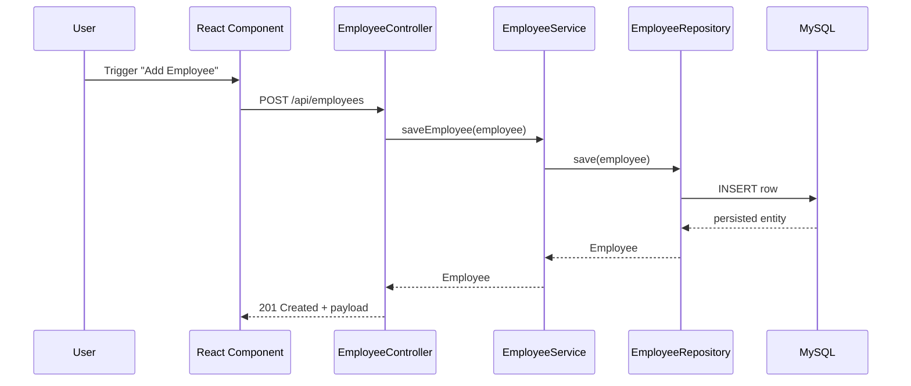
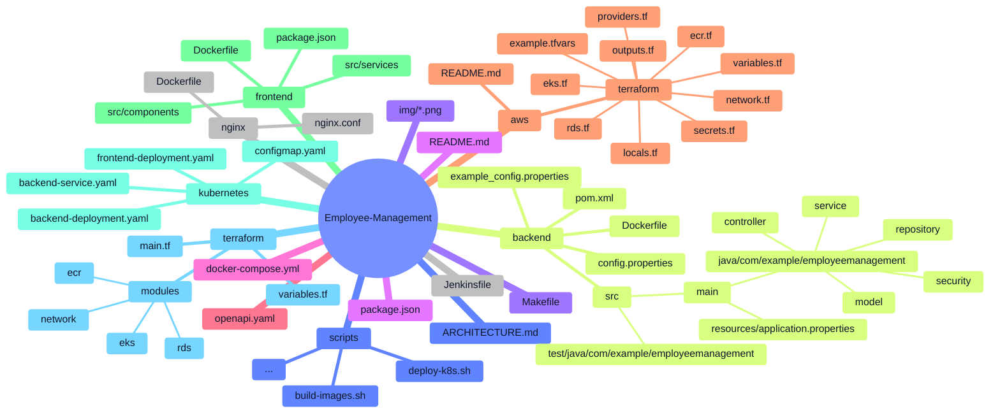

# Employee Management Full-Stack Application

The **Employee Management Full-Stack Application** is a modern, feature-rich system for managing employee and department data, built to demonstrate the power of combining traditional enterprise technologies with modern web frameworks. It leverages a responsive React frontend alongside a robust Spring Boot backend, delivering a seamless user experience with features such as CRUD operations, data visualization, authentication, and secure REST APIs. 

  

### Request Lifecycle

> [!IMPORTANT]
> **Note:** The backend API may spin down due to inactivity, so you may need to wait for up to 2 minutes for the API to start up again. Feel free to test the API endpoints and explore the application. Or, you can run the backend locally and connect it to the frontend for a more seamless experience.
**Landing Page:**

  

**Dashboard Page:**

  

**Employee List Page:**

  

**Department List Page:**

  

**Profile Page:**

  

**Login Page:**

  

**Register Page:**

  

 And many more features & pages to explore! Feel free to navigate through the application and test the various functionalities.

## API Endpoints

Here's a table listing all the RESTful API endpoints provided by this application:

| Endpoint                | Method | Description                         |
|-------------------------|--------|-------------------------------------|
| `/api/employees`        | GET    | Get all employees                   |
| `/api/employees/{id}`   | GET    | Get an employee by ID               |
| `/api/employees`        | POST   | Add a new employee                  |
| `/api/employees/{id}`   | PUT    | Update an employee by ID            |
| `/api/employees/{id}`   | DELETE | Delete an employee by ID            |
| `/api/departments`      | GET    | Get all departments                 |
| `/api/departments/{id}` | GET    | Get a department by ID              |
| `/api/departments`      | POST   | Add a new department                |
| `/api/departments/{id}` | PUT    | Update a department by ID           |
| `/api/departments/{id}` | DELETE | Delete a department by ID           |
| `/swagger-ui.html`      | GET    | Access the Swagger UI documentation |

## File Structure

> [!TIP]
> Note: Generated directories such as `node_modules/`, `target/`, and `build/` are omitted for brevity.

## Architecture Reference

For a deeper dive into components, data flow, security posture, and recommended follow-up tasks, see [ARCHITECTURE.md](ARCHITECTURE.md). It cross-references the exact source files (controllers, services, repositories, configuration, tests, and infrastructure) described in this README.

