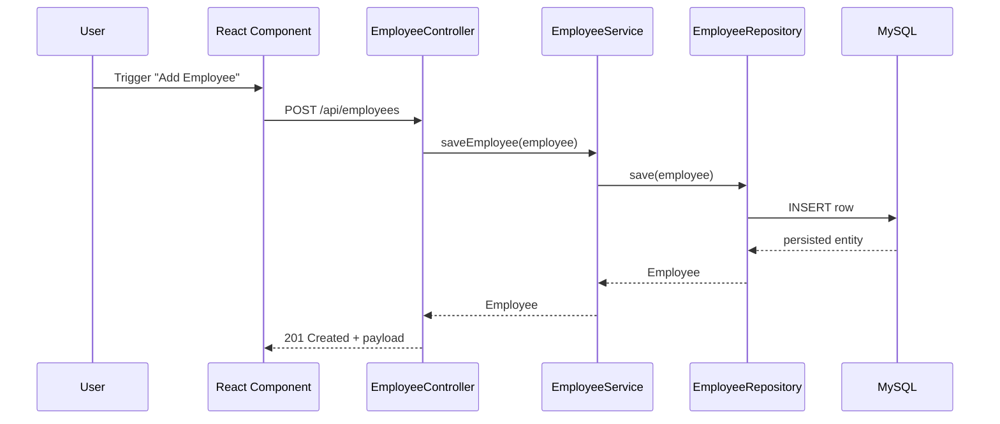
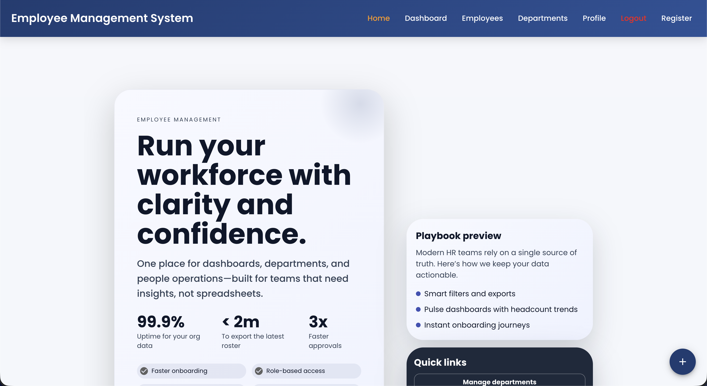
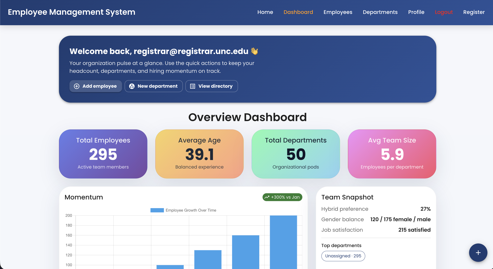
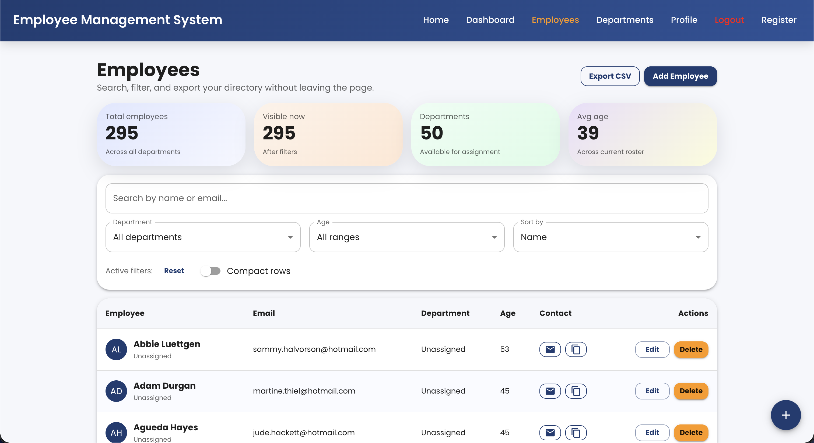
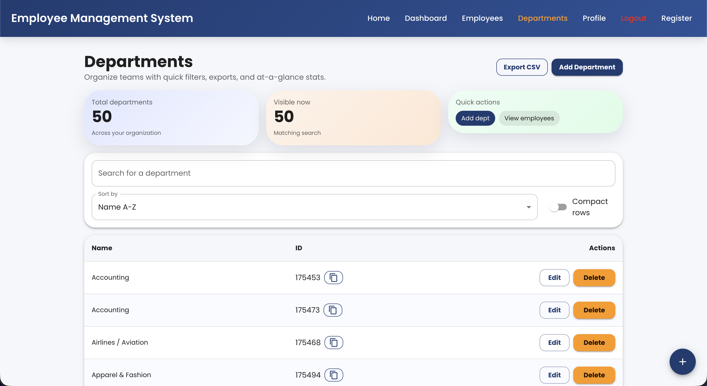
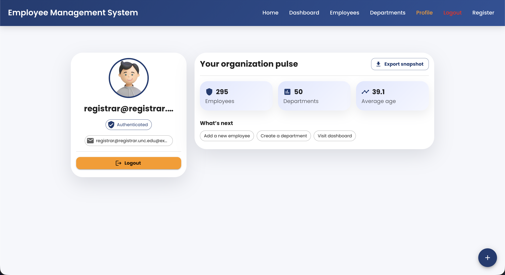
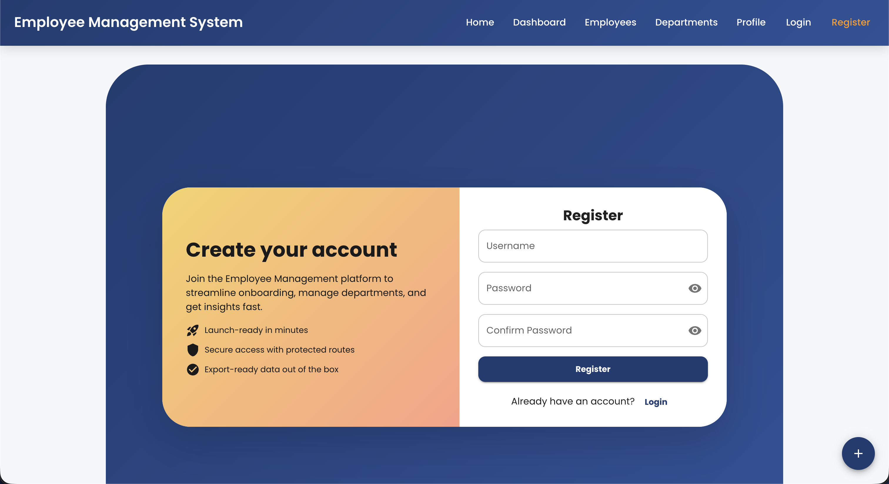
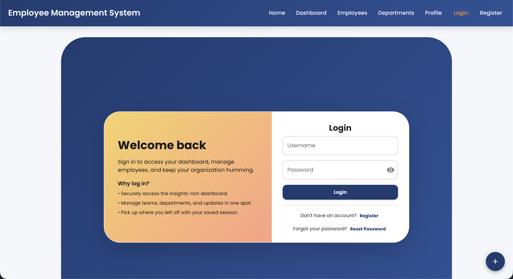
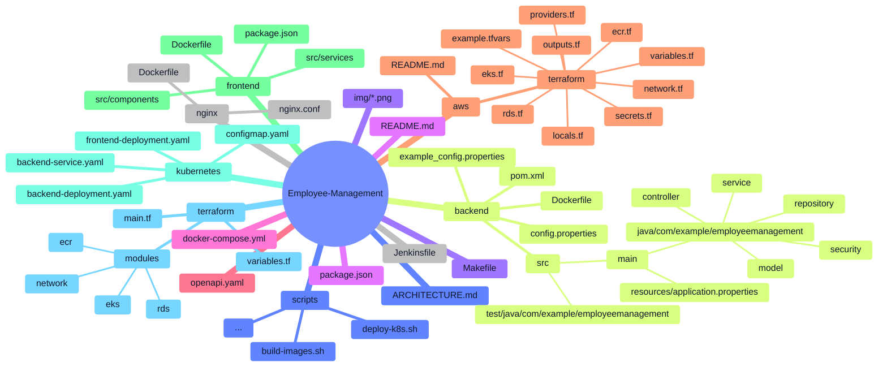

# Employee Management Full-Stack Application

The **Employee Management Full-Stack Application** is a modern, feature-rich system for managing employee and department data, built to demonstrate the power of combining traditional enterprise technologies with modern web frameworks. It leverages a responsive React frontend alongside a robust Spring Boot backend, delivering a seamless user experience with features such as CRUD operations, data visualization, authentication, and secure REST APIs. 

  

## Overview

The Employee Management System is a dynamic full-stack application that seamlessly combines cutting-edge and traditional technologies. By integrating a modern **React** frontend with a classic **Spring Boot** backend, this project demonstrates how new and established technologies can harmoniously work together to create a robust and efficient application for managing employee and department data!

## Architecture at a Glance

- React SPA (Material UI, Tailwind CSS, Chart.js) consumes the Spring Boot REST API over HTTPS via Axios.
- Spring Boot layers (controller → service → repository) persist to MySQL through Spring Data JPA and seed demo data with Faker-powered `DataInitializer`.
  

### Request Lifecycle

> [!IMPORTANT]
> **Note:** The backend API may spin down due to inactivity, so you may need to wait for up to 2 minutes for the API to start up again. Feel free to test the API endpoints and explore the application. Or, you can run the backend locally and connect it to the frontend for a more seamless experience.

> [!NOTE]
> **Additional Note:** It may take a while to fetch the data and process your requests, as Render's free tier has VERY limited resources (only 512MB RAM and 0.1 CPU).

## Key Technologies

- **React (Frontend)**: A modern JavaScript library for building user interfaces, providing a responsive and interactive experience.
  - **React Router**: A routing library for React that enables navigation and URL handling in single-page applications.
  - **Chart.js**: A JavaScript library for creating responsive and customizable charts and graphs.
  - **Axios**: A promise-based HTTP client for making API requests.
  - **Tailwind CSS**: A utility-first CSS framework for creating custom designs with minimal CSS.
  - **Redux**: A predictable state container for managing application state.
  - **Jest and React Testing Library**: Testing libraries for unit and integration testing React components.
- **Java Spring Boot (Backend)**: A powerful, established Java framework for building production-ready applications with Java, offering robust backend support and data management.
  - **Spring Data JPA**: A part of the Spring Data project that makes it easy to implement JPA-based repositories.
  - **Spring Boot Actuator**: A set of production-ready features that help monitor and manage the application.
  - **Spring Hibernate**: An object-relational mapping (ORM) library for Java that provides a framework for mapping an object-oriented domain model to a relational database.
  - **Spring Boot Starter Web**: A starter for building web applications, including RESTful, application, and WebSocket services.
  - **Spring Boot Starter Data JPA**: A starter for using Spring Data JPA with Hibernate.
  - **RESTful APIs**: Representational state transfer (REST) APIs for communication between the frontend and backend.
  - **Java 11**: The latest LTS version of Java, providing long-term support and stability.
  - **JUnit 5**: A popular testing framework for Java that provides annotations for writing tests.
  - **Swagger**: A tool for documenting and testing RESTful APIs.
- **Docker**: A containerization platform for packaging applications and their dependencies.
- **Kubernetes**: An open-source container orchestration platform for automating deployment, scaling, and management of containerized applications.
- **MySQL**: A reliable relational database for structured data storage.
- **MongoDB**: A flexible NoSQL database for non-relational data.
- **Style Guides**: This project follows the following popular style guides to ensure clean and consistent code.
  - **Airbnb JavaScript Style Guide**: A popular style guide for writing clean and consistent JavaScript code.
  - **Google Java Style Guide**: A style guide for writing Java code that is readable and maintainable.

## User Interface

The frontend of the Employee Management System provides a user-friendly interface for managing employees and departments. It includes features for viewing, adding, editing, and deleting employees and departments. The app also includes visualizations for employee metrics such as growth over time and distribution by age range.

**Landing Page:**

  

**Dashboard Page:**

  

**Employee List Page:**

  

**Department List Page:**

  

**Profile Page:**

  

**Login Page:**

  

**Register Page:**

  

 And many more features & pages to explore! Feel free to navigate through the application and test the various functionalities.

## API Endpoints

Here's a table listing all the RESTful API endpoints provided by this application:

| Endpoint                | Method | Description                         |
|-------------------------|--------|-------------------------------------|
| `/api/employees`        | GET    | Get all employees                   |
| `/api/employees/{id}`   | GET    | Get an employee by ID               |
| `/api/employees`        | POST   | Add a new employee                  |
| `/api/employees/{id}`   | PUT    | Update an employee by ID            |
| `/api/employees/{id}`   | DELETE | Delete an employee by ID            |
| `/api/departments`      | GET    | Get all departments                 |
| `/api/departments/{id}` | GET    | Get a department by ID              |
| `/api/departments`      | POST   | Add a new department                |
| `/api/departments/{id}` | PUT    | Update a department by ID           |
| `/api/departments/{id}` | DELETE | Delete a department by ID           |
| `/swagger-ui.html`      | GET    | Access the Swagger UI documentation |

## File Structure

> [!TIP]
> Note: Generated directories such as `node_modules/`, `target/`, and `build/` are omitted for brevity.

## Architecture Reference

For a deeper dive into components, data flow, security posture, and recommended follow-up tasks, see [ARCHITECTURE.md](ARCHITECTURE.md). It cross-references the exact source files (controllers, services, repositories, configuration, tests, and infrastructure) described in this README.

